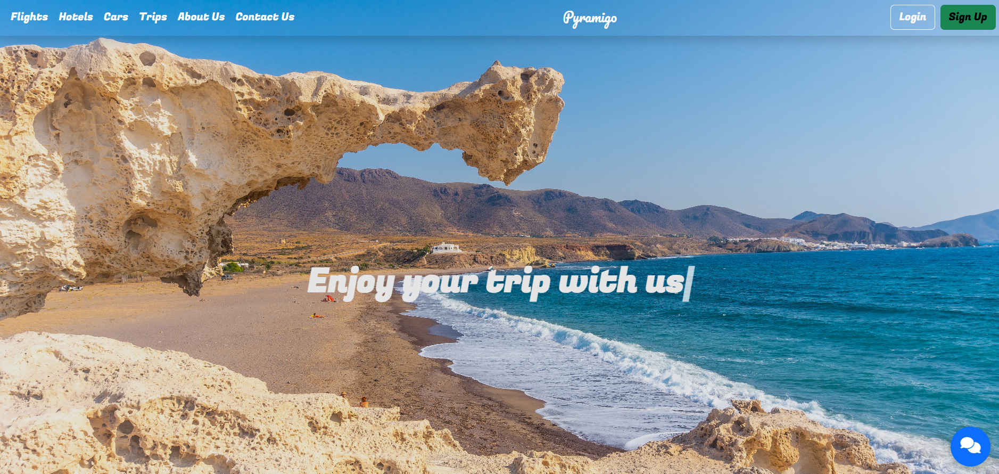

# 🏝️ TravelBooking Angular Project


A modern, full-featured **frontend project** for TravelBooking. This Angular project powers the user-facing website and admin dashboard, providing a seamless experience for browsing and managing tours, hotels, flights, and car rentals.

🌍 **Live Demo** → [Pyramigo](http://pyramigo.duckdns.org/tour)

---

## 📗 Table of Contents
- [📖 About the Project](#-about-the-project)
- [🛠 Built With](#-built-with)
  - [Tech Stack](#tech-stack)
- [🚀 Live Demo](#-live-demo)
- [💻 Getting Started](#-getting-started)
  - [Prerequisites](#prerequisites)
  - [Setup](#setup)
  - [Install](#install)
  - [Usage](#usage)
  - [Deployment](#deployment)
- [👥 Authors](#-authors)
- [🔭 Future Features](#-future-features)
- [⭐️ Show your support](#-show-your-support)
- [🙏 Acknowledgements](#-acknowledgements)
- [❓ FAQ](#-faq)
- [📝 License](#-license)

---

## 📖 About the Project

This Angular project is the **frontend** of the TravelBooking platform. It includes:

- **User-facing website** for browsing tours, hotels, flights, and cars.  
- **Admin Dashboard** for agencies to manage their services.  
- Full integration with the backend API for bookings, payments, reviews, and wishlist.

Repositories:
- **Backend API** → [TravelBooking](https://github.com/Ahmedabdelfatah11/TravelBooking)  
- **Admin Dashboard** → [Travel-Booking-Admin-Dashboard](https://github.com/Ahmedabdelfatah11/Travel-Booking-Admin-Dashboard)  
- **User Website** → [TravelBookingAngularProject](https://github.com/Ahmedabdelfatah11/TravelBookingAngularProject)

---

## 🛠 Built With

### Tech Stack
- **Frontend**: Angular 20, RxJS, Bootstrap  
- **Payment Integration**: Stripe  

---

## 🚀 Live Demo
🌍 [Pyramigo - Live Site](http://pyramigo.duckdns.org/tour)
---


## 💻 Getting Started

### Prerequisites
- Node.js & npm  
- Angular CLI  
- Access to the backend API (TravelBooking API)

### Setup
Clone the repository:

```bash
git clone https://github.com/Ahmedabdelfatah11/TravelBookingAngularProject.git
```

## Install Dependencies
``` bash
cd TravelBookingAngularProject
npm install
```

## Usage
``` bash
Run the Angular app:

ng serve
```
Visit http://localhost:4200 in your browser.


## Deployment

Angular app can be hosted on Netlify, Vercel, or served via Nginx.


## 👥 Authors

All Full Stack Developers:

- [Ahmed Abdelfatah](https://github.com/Ahmedabdelfatah11)
- [Mohamed Sayed](https://github.com/mohamed200184)
- [Abanoub Emad](https://github.com/Abanoubemad21)
- [Ayman Abdelnaby](https://github.com/AymanAbdelnaby12)
- [Ahmed Elmahdy](https://github.com/ahmedelmahdy77)

## 🔭 Future Features

Multi-language support 🌐

AI-powered travel recommendations 🤖

Mobile app integration 📱

## ⭐️ Show your support

If you like this project, please ⭐ it on GitHub!

## 🙏 Acknowledgements

Inspired by Booking.com & Expedia
Thanks to the open-source community ❤️

## ❓ FAQ

Q: Can I use this project for my agency?
A: Yes, it’s open-source under MIT License.

📝 License

This project is MIT licensed.


---

If you want, I can **also add a badges section for this Angular project** (Angular, RxJS, Bootstrap, Stripe, SignalR) at the top just like the backend one, for visual consistency.  

Do you want me to do that next?

